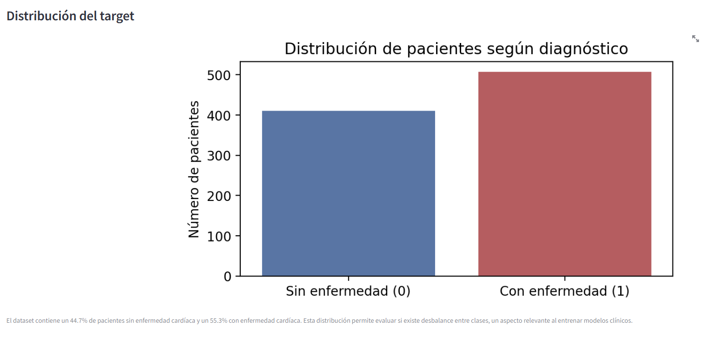
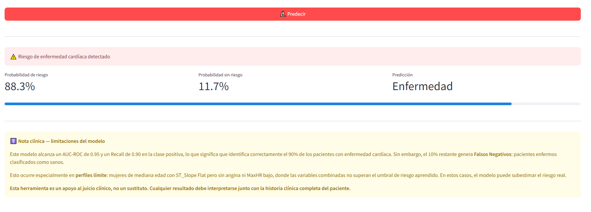
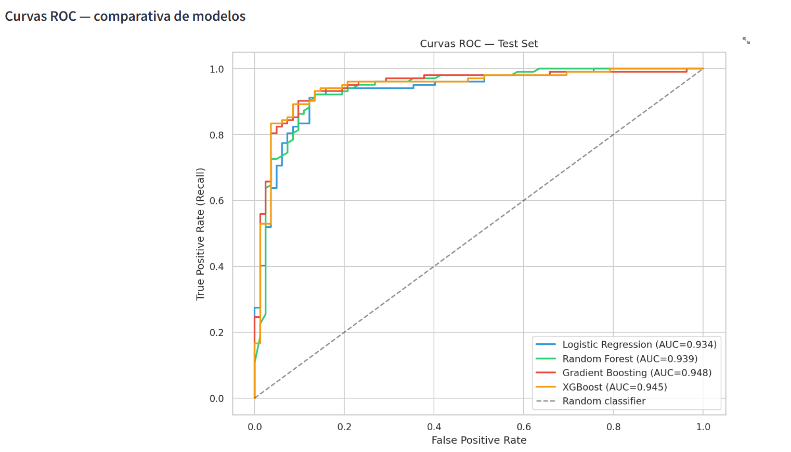

# Heart Failure Prediction

Machine learning pipeline for predicting heart disease from clinical variables, with an interactive Streamlit dashboard deployed on the cloud.

🔗 **[Live Demo](https://heart-failure-prediction-7mdg7icotdktvshgfnyyp6.streamlit.app/)**

---

## Overview

This project builds an end-to-end ML pipeline on a real clinical dataset — from exploratory data analysis to a deployed interactive application. The goal is to predict the presence of heart disease in a patient based on 11 clinical features, prioritizing **Recall** as the key metric to minimize false negatives in a medical context.

---

## Dashboard

| Tab 1 — Exploration | Tab 2 — Prediction | Tab 3 — Model |
|---|---|---|
|  |  |  |

---

## Dataset

**Source:** [fedesoriano — Heart Failure Prediction](https://www.kaggle.com/datasets/fedesoriano/heart-failure-prediction) (Kaggle)

Combines 5 real hospital datasets: Cleveland, Hungarian, Long Beach VA, Switzerland and Statlog.

| Property | Value |
|---|---|
| Patients | 920 |
| Features | 11 clinical variables |
| Target | `HeartDisease` (binary: 0 / 1) |
| Missing values | None (after cleaning) |

**Key features:** Age, Sex, ChestPainType, RestingBP, Cholesterol, FastingBS, RestingECG, MaxHR, ExerciseAngina, Oldpeak, ST_Slope.

**Data quality note:** `Cholesterol=0` and `RestingBP=0` were identified as recording errors (physiologically impossible) and imputed using group median by target class.

---

## Methodology

### 1 · Exploratory Data Analysis
- Distribution of target variable and class balance check
- Numerical and categorical feature analysis by class
- Outlier detection and identification of recording errors
- Correlation analysis and bivariate visualizations

### 2 · Preprocessing
- Imputation of recording errors with group median (by `HeartDisease`)
- One-Hot Encoding of categorical variables (`drop_first=True`)
- Stratified 80/20 train/test split
- StandardScaler inside Pipeline to prevent data leakage

### 3 · Modeling
Four models compared using 5-fold stratified cross-validation on the training set:

| Model | AUC-ROC (CV) |
|---|---|
| Logistic Regression | 0.934 |
| Random Forest | 0.939 |
| **Gradient Boosting** | **0.948** ✅ |
| XGBoost | 0.945 |

### 4 · Evaluation (test set)

| Metric | Value |
|---|---|
| AUC-ROC | 0.9479 |
| F1-Score | 0.9020 |
| Accuracy | 0.8913 |
| Recall (positive class) | 0.90 |

**Metric rationale:** AUC-ROC was prioritized over accuracy for model selection. In a clinical context, false negatives (sick patients classified as healthy) carry higher cost than false positives — Recall on the positive class was therefore the key evaluation criterion.

### 5 · Feature Importance

`ST_Slope_Up` dominates with ~50% importance — its absence is a classic marker of myocardial ischemia. `MaxHR` and `Oldpeak` reflect cardiac stress response. `ChestPainType` and `Sex` complete the cardiovascular risk profile.

---

## Project Structure

```
heart-failure-prediction/
│
├── notebooks/
│   ├── 01_EDA_heart_failure.ipynb
│   └── 02_preprocessing_modeling.ipynb
│
├── 03_streamlit_app/
│   └── app.py
│
├── models/
│   ├── best_model_gradient_boosting.pkl
│   └── feature_names.pkl
│
├── plots/
│   ├── 10_roc_curves.png
│   ├── 11_confusion_matrices.png
│   └── 12_feature_importance.png
│
├── assets/
│   ├── TAB1.PNG
│   ├── TAB2.PNG
│   └── TAB3.PNG
│
├── heart.csv
├── heart_processed.csv
├── requirements.txt
├── runtime.txt
└── README.md
```

---

## Run Locally

```bash
# Clone the repository
git clone https://github.com/SergioFalco6/heart-failure-prediction.git
cd heart-failure-prediction

# Install dependencies
pip install -r requirements.txt

# Run the app
python -m streamlit run 03_streamlit_app/app.py
```

---

## Tech Stack

| Category | Tools |
|---|---|
| Language | Python 3.11 |
| Data | pandas, numpy |
| Visualization | matplotlib, seaborn |
| ML | scikit-learn, XGBoost |
| Dashboard | Streamlit |
| Deployment | Streamlit Cloud |
| Version control | Git, GitHub |

---

## Clinical Note

This model achieves a Recall of 0.90 on the positive class, meaning it correctly identifies 90% of patients with heart disease. The remaining 10% generate **false negatives** — sick patients classified as healthy. This occurs especially in borderline profiles where combined variables do not exceed the learned risk threshold.

**This tool is intended as a clinical decision support aid, not a diagnostic replacement. All results should be interpreted alongside the patient's full clinical history.**

---

## Author

**Sergio Falcó** · Biomedical Engineer  
[GitHub](https://github.com/SergioFalco6)
